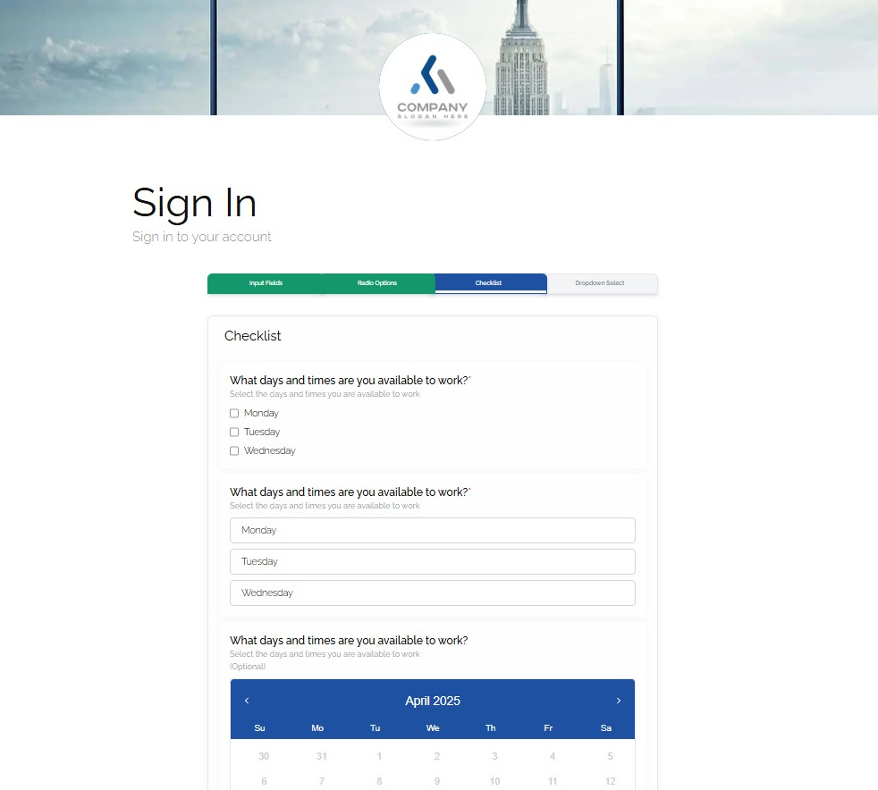

Sign-In Portal
A modern, responsive sign-in portal built with Next.js, React Hook Form, and Zod validation.
Highly configurable and customizable.
The main purpose of this application is to collect user data through intuitive form interfaces and securely submit it to backend databases. The modular design allows for easy adaptation to various data collection needs.

// screenshot

You can customize the portal by modifying the configuration in data/config.ts:
- Header images
- Company logos
- Footer content

Features
Clean, Professional UI: Elegant design with header image, centered company logo, and organized layout
Form Validation: Client-side validation using Zod schema validation
Responsive Design: Optimized for all device sizes from mobile to desktop
Theme Support: Light/dark mode toggle capability
Modular Components: Well-structured component architecture for maintainability
Reusable Form Elements: Customizable form components that can be adapted for various use cases
Data Collection: Designed to efficiently gather user data and submit it to databases

Technology Stack
Framework: Next.js 14 (React)
Styling: Tailwind CSS
Form Management: React Hook Form
Validation: Zod schema validation
API Integration: Next.js API routes

Project Structure
├── app/
│   ├── api/
│   │   └── zod/
│   │       └── route.ts       # API endpoint for form submission
│   └── page.tsx               # Main sign-in page
├── components/
│   ├── Form/
│   │   └── signin-form.tsx    # Sign-in form component
│   ├── form-elements/
│   │   ├── date-picker-open.tsx    # Date picker/calendar
│   │   ├── date-time-picker.tsx    # Date and time input
│   │   ├── checklist.tsx           # Checklist variation 1
│   │   ├── checklist-buttons.tsx   # Checklist variation 2
│   │   ├── dropdown-select.tsx     # Combobox dropdown, search, select, badges
│   │   ├── input-field.tsx         # Text input
│   │   ├── password-field.tsx      # Password/hashed input with toggle visibility icon
│   │   ├── textarea-field.tsx      # Textarea input
│   │   ├── radio-options.tsx       # Radio buttons variation 1
│   │   ├── radio-options-buttons.tsx # Radio buttons variation 2
│   │   ├── radio-options-boolean.tsx # Radio buttons variation 3
│   │   └── error-field-area.tsx        # Animating error message for large components
│   │   └── error-field-input.tsx       # Animating error message for small components
│   └── ui/
│       └── ThemeToggler_Button.tsx
├── data/
│   └── config.ts              # Configuration for images and content
└── ...

Installation
1. Clone the repository
git clone https://github.com/yourusername/signin-portal.git
cd signin-portal

2. Install dependencies
npm install
# or
yarn install

3. Run the development server
npm run dev
# or
yarn dev

Open http://localhost:3000 in your browser

